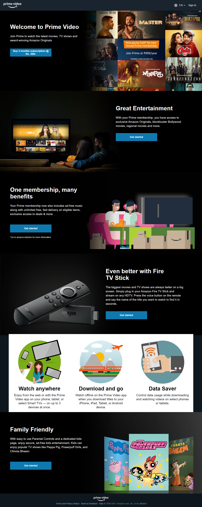
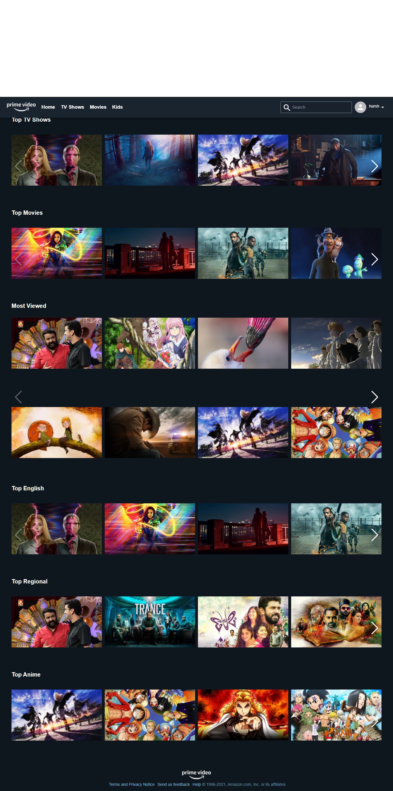
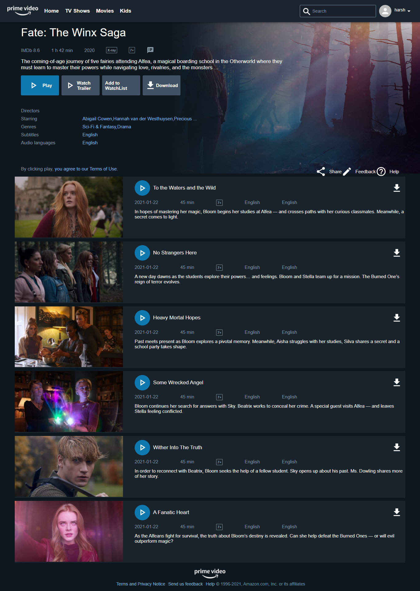

# primevideo
# Team Quadrilateral

# Prime Video- Clone
 
<h3> An Effort into Making a pixel perfect clone of Amazon Prime Video </h3>

  Amazon Prime Video, or simply Prime Video, is an American subscription video on-demand over-the-top streaming and rental service of Amazon.com, Inc., offered as a standalone service or as part of Amazon's Prime subscription. The service primarily distributes films and television series produced by Amazon Studios or licensed to Amazon, as Prime Originals (or Amazon Originals) or Exclusives, with the service also hosting content from other providers, content add-ons, live sporting events, and video rental and purchasing services.
 

## Tech Stack used:

<code></code>
<code></code>
<code></code>
<code></code>
<code></code>
<code></code>
<code></code>
<code></code>
<code></code>

## <code>Sneak Peak</code>
## <code>Landing Page</code>

## <code>Home Page</code>

## <code>TV Show</code>

### Installation and Setup Instructions

Clone this repository. 
You will need node and npm installed globally on your machine. You will also need Redis Server v3.05.
Installation: npm install To install dependencies
Redis: redis-server
Run:npm run dev to run the App
App runs on port 3000
Server runs on port 8001

## Tech Library used:
  <ul>
  <li>React APP</li>
  <li>Axios</li>
  <li>Material UI</li>
<li>bcrypt</li>
<li>bcryptjs</li>
<li>concurrently</li>
<li>cors</li>
<li>dotenv</li>
<li>express</li>
<li>react-media-player</li>
  <li>react-hooks-responsive</li>
<li>joi</li>
<li>jsonwebtoken</li>
<li>mongoose</li>
  <li>nodemailer</li>
<li>razorpay</li>
<li>react-router-dom</li>
<li>request</li>
<li>uuid</li>
    <li>email-validator</li>
    <li>react</li>
    <li>react-dom</li>
    <li>react-redux</li>
    <li>react-router-dom</li>
    <li>react-scripts</li>
    <li>swiper</li>
    <li>redux</li>
    <li>redux-devtools-extension</li>
    <li>redux-thunk</li>
    <li>styled-components</li>
  </ul>

## Contributors
<h3>Shamsher Ali</h3>👨‍- <a href="https://github.com/syedshamsher" >Shamsher</a>
<h3>Charleson Davis</h3>👨‍- <a href="https://github.com/normandy17" >Charleson</a>
<h3>Harsh Verma</h3>👨‍ -  <a href="https://github.com/HarshVerm">Harsh</a> 

### Special Thanks

  We Thank Masai for giving this opportunity   We thank Mr.Albert, Ms.Santhisri and Mr.Dhaval for guiding us through this project  
  We also would like to thank Mr.Albert, Mr.Nrupul, Mr.Abhishek and Mr.Yogesh for imparting their valuable knowledge.

<h2> Happy Hacking </h2>
